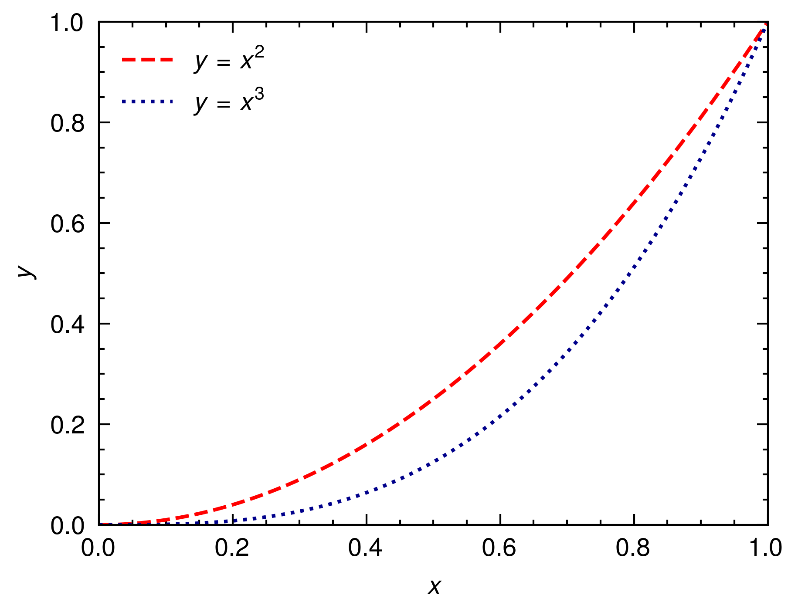

# Peroxide

[](https://crates.io/crates/peroxide)
[](https://docs.rs/peroxide/)
[](https://builds.sr.ht/~axect/Peroxide/.build.yml?)


Rust numeric library contains linear algebra, numerical analysis, statistics and machine learning tools with R, MATLAB, Python like macros.

## Why Peroxide?

### 1. Back-end options

Peroxide provides two back-end options.

* Default - Pure Rust (No dependencies of architecture - Perfect cross compilation)
* BLAS - No pain, no gain. (Perfect performance but hard to set-up - Strongly recommend to read [OpenBLAS for Rust](https://github.com/Axect/Issues/tree/master/Rust)

So, if you are familiar with unix environment (can setup BLAS environment), then you can get one of the fastest scientific computation tools.
Or if you hate dependencies from fortran, C/C++ libraries, then you can get comfortable scientific computation tools. 
 
### 2. Easy to optimize

Peroxide uses 1D data structure to describe matrix. So, it's too easy to integrate BLAS.
It means peroxide guarantees perfect performance for linear algebraic computations.

### 3. Friendly syntax

Rust is so strange for Numpy, MATLAB, R users. Thus, it's harder to learn the more rust libraries.
With peroxide, you can do heavy computations with R, Numpy, MATLAB like syntax.

For example,

```rust
extern crate peroxide;
use peroxide::*;

fn main() {
    // MATLAB like matrix constructor
    let a = ml_matrix("1 2;3 4");

    // R like matrix constructor (default)
    let b = matrix(c!(1,2,3,4), 2, 2, Row);

    // Or use zeros
    let mut z = zeros(2, 2);
    z[(0,0)] = 1.0;
    z[(0,1)] = 2.0;
    z[(1,0)] = 3.0;
    z[(1,1)] = 4.0;
    
    // Simple but effective operations
    let c = a * b; // Matrix multiplication (BLAS integrated)

    // Easy to pretty print
    c.print();
    //       c[0] c[1]
    // r[0]     1    3
    // r[1]     2    4
}
```

### 4. Batteries included

Peroxide can do many things. Refer to `Covered contents`.

### 5. Written in Rust

Rust & Cargo are awesome for scientific computations. 
You can use any external packages easily with Cargo, not make.
And default runtime performance of Rust is also great. If you use many iterations for computations,
then Rust become great choice.

## Latest README version

Corresponding to `0.14.0` (not yet released).

## Pre-requisite

* Python module : `matplotlib` for plotting

## Install

* Add next block to your `cargo.toml`
```toml
[dependencies.peroxide]
version = "0.14"
default-features = false
features = ["native"]
```

## Module Structure

- __src__
  - [lib.rs](src/lib.rs) : `mod` and `re-export`
  - __macros__ : Macro files
    - [julia_macro.rs](src/macros/julia_macro.rs) : Julia like macro
    - [matlab_macro.rs](src/macros/matlab_macro.rs) : MATLAB like macro
    - [mod.rs](src/macros/mod.rs)
    - [r_macro.rs](src/macros/r_macro.rs) : R like macro
  - __ml__ : For machine learning (*Beta*)
      - [mod.rs](src/ml/mod.rs)
      - [reg.rs](src/ml/reg.rs) : Regression tools
  - __numerical__ : To do numerical things
    - [bdf.rs](src/numerical/bdf.rs) : Backward Differentiation Formula
    - [gauss_legendre.rs](src/numerical/gauss_legendre.rs) : Gauss-Legendre 4th order
    - [interp.rs](src/numerical/interp.rs) : Interpolation
    - [mod.rs](src/numerical/mod.rs)
    - [newton.rs](src/numerical/newton.rs) : Newton's Method
    - [ode.rs](src/numerical/ode.rs) : Main ODE solver
    - [optimize.rs](src/numerical/optimize.rs) : Non-linear regression
    - [spline.rs](src/numerical/spline.rs) : Natural Spline
    - [utils.rs](src/numerical/utils.rs) : Utils to do numerical things (e.g. jacobian)
  - __operation__ : To define general operations
    - [extra_ops.rs](src/operation/extra_ops.rs) : Missing operations & Real Trait
    - [mut_ops.rs](src/operation/mut_ops.rs) : Mutable operations
    - [mod.rs](src/operation/mod.rs)
    - [number.rs](src/operation/number.rs) : Number type (include `f64`, `Dual`)
  - __special__ : Wrapper for `special` crate
    - [mod.rs](src/special/mod.rs)
    - [function.rs](src/special/function.rs) : Special functions
  - __statistics__ : Statistical Tools
    - [mod.rs](src/statistics/mod.rs)
    - [dist.rs](src/statistics/dist.rs) : Probability distributions
    - [ops.rs](src/statistics/ops.rs) : Some probabilistic operations
    - [rand.rs](src/statistics/rand.rs) : Wrapper for `rand` crate
    - [stat.rs](src/statistics/stat.rs) : Statistical tools
  - __structure__ : Fundamental data structures
    - [dataframe.rs](src/structure/dataframe.rs) : Not yet implemented
    - [dual.rs](src/structure/dual.rs) : Dual number system for automatic differentiation
    - [hyper_dual.rs](src/structure/hyper_dual.rs) : Hyper dual number system for automatic differentiation
    - [matrix.rs](src/structure/matrix.rs) : Matrix
    - [multinomial.rs](src/structure/multinomial.rs) : For multinomial (*Beta*)
    - [mod.rs](src/structure/mod.rs)
    - [polynomial.rs](src/structure/polynomial.rs) : Polynomial
    - [vector.rs](src/structure/vector.rs) : Extra tools for `Vec<f64>`
  - __util__
    - [mod.rs](src/util/mod.rs)
    - [api.rs](src/util/api.rs) : Matrix constructor for various language style 
    - [non_macro.rs](src/util/non_macro.rs) : Primordial version of macros
    - [pickle.rs](src/util/pickle.rs) : To handle `pickle` data structure
    - [plot.rs](src/util/plot.rs) : To draw plot (using `pyo3`)
    - [print.rs](src/util/print.rs) : To print conveniently
    - [useful.rs](src/util/useful.rs) : Useful utils to implement library
    - [writer.rs](src/util/writer.rs) : More convenient write system


## Documentation

* [](https://docs.rs/peroxide/)

## Covered Contents

* Linear Algebra
    * Effective Matrix structure
    * Transpose, Determinant, Diagonal
    * LU Decomposition, Inverse matrix, Block partitioning
    * Column, Row operations
* Functional Programming
    * More easy functional programming with `Vec<f64>`
    * For matrix, there are three maps
        * `fmap` : map for all elements
        * `col_map` : map for column vectors
        * `row_map` : map for row vectors
* Automatic Differentiation
    * Dual number system - for 1st order AD
    * Hyper dual number system - for 2nd order AD
    * Exact jacobian
    * `Real` trait to constrain for `f64` and `Dual`
    * `Number` structure to unify `f64` and `Dual`
* Numerical Analysis
    * Lagrange interpolation
    * Cubic spline
    * Non-linear regression
        * Gradient Descent
        * Gauss Newton
        * Levenberg Marquardt
    * Ordinary Differential Equation
        * Euler
        * Runge Kutta 4th order
        * Backward Euler
        * Gauss Legendre 4th order
* Statistics
    * More easy random with `rand` crate
    * Probability Distributions
        * Bernoulli
        * Uniform
        * Normal
        * Gamma
        * Beta
    * RNG algorithms
        * Acceptance Rejection
        * Marsaglia Polar
        * Ziggurat
* Special functions
    * Wrapper for `special` crate
* Utils
    * R-like macro & functions
    * Matlab-like macro & functions
    * Numpy-like macro & functions
    * Julia-like macro & functions
* Plotting
    * With `pyo3` & `matplotlib`


## Example

### Basic Runge-Kutta 4th order with inline-python

```rust
#![feature(proc_macro_hygiene)]
extern crate peroxide;
extern crate inline_python;
use peroxide::*;
use inline_python::python;

fn main() {
    // Initial condition
    let init_state = State::<f64>::new(0f64, c!(1), c!(0));

    let mut ode_solver = ExplicitODE::new(test_fn);

    ode_solver
        .set_method(ExMethod::RK4)
        .set_initial_condition(init_state)
        .set_step_size(0.01)
        .set_times(1000);

    let result = ode_solver.integrate();

    let x = result.col(0);
    let y = result.col(1);

    // Plot (Thanks to inline-python)
    python! {
        import pylab as plt
        plt.plot('x, 'y)
        plt.show()
    }
}

// dy/dx = (5x^2 - y) / e^(x+y)
fn test_fn(st: &mut State<f64>) {
    let x = st.param;
    let y = &st.value;
    let dy = &mut st.deriv;
    dy[0] = (5f64 * x.powi(2) - y[0]) / (x + y[0]).exp();
}
```

### Basic Runge-Kutta 4th order with advanced plotting

```rust
extern crate peroxide;
use peroxide::*;

fn main() {
    let init_state = State::<f64>::new(0f64, c!(1), c!(0));

    let mut ode_solver = ExplicitODE::new(test_fn);

    ode_solver
        .set_method(ExMethod::RK4)
        .set_initial_condition(init_state)
        .set_step_size(0.01)
        .set_times(1000);

    let result = ode_solver.integrate();

    let x = result.col(0);
    let y = result.col(1);

    // Plot (using python matplotlib)
    let mut plt = Plot2D::new();
    plt.set_domain(x)
        .insert_image(y)
        .set_title("Test Figure")
        .set_fig_size((10, 6))
        .set_dpi(300)
        .set_legends(vec!["RK4"])
        .set_path("example_data/test_plot.png");

    plt.savefig();
}

fn test_fn(st: &mut State<f64>) {
    let x = st.param;
    let y = &st.value;
    let dy = &mut st.deriv;
    dy[0] = (5f64 * x.powi(2) - y[0]) / (x + y[0]).exp();
}
```

### Basic Runge-Kutta 4th order with Stop condition

```rust
extern crate peroxide;
use peroxide::*;

fn main() {
    let init_state = State::<f64>::new(0f64, c!(1), c!(0));

    let mut ode_solver = ExplicitODE::new(test_fn);

    ode_solver
        .set_method(ExMethod::RK4)
        .set_initial_condition(init_state)
        .set_step_size(0.01)
        .set_stop_condition(stop)        // Add stop condition
        .set_times(1000);

    let result = ode_solver.integrate();

    let x = result.col(0);
    let y = result.col(1);

    let mut plt = Plot2D::new();
    plt.set_domain(x)
        .insert_image(y)
        .set_title("Test Figure")
        .set_fig_size((10, 6))
        .set_dpi(300)
        .set_legends(vec!["RK4"])
        .set_path("example_data/test_plot.png");

    plt.savefig();
}

fn test_fn(st: &mut State<f64>) {
    let x = st.param;
    let y = &st.value;
    let dy = &mut st.deriv;
    dy[0] = (5f64 * x.powi(2) - y[0]) / (x + y[0]).exp();
}

fn stop(st: &ExplicitODE) -> bool {
    let y = &st.get_state().value[0];
    (*y - 2.4).abs() < 0.01
}
```



### Multi-Layer Perceptron (from scratch)

```rust
extern crate peroxide;
use peroxide::*;

// x : n x L
// xb: n x (L+1)
// v : (L+1) x M
// a : n x M
// ab: n x (M+1)
// w : (M+1) x n
// wb: M x N
// y : n x N
// t : n x N
// dh: n x M
// do: n x N

fn main() {
    let v = weights_init(3, 2);
    let w = weights_init(3, 1);

    let x = ml_matrix("0 0; 0 1; 1 0; 1 1");
    let t = ml_matrix("0;1;1;0");

    let y = train(v, w, x, t, 0.25, 5000);
    y.print();
}

fn weights_init(m: usize, n: usize) -> Matrix {
    rand(m, n) * 2f64 - 1f64
}

fn sigmoid(x: f64) -> f64 {
    1f64 / (1f64 + (-x).exp())
}

fn forward(weights: Matrix, input_bias: Matrix) -> Matrix {
    let s = input_bias * weights;
    s.fmap(|x| sigmoid(x))
}

fn add_bias(input: Matrix, bias: f64) -> Matrix {
    let b = matrix(vec![bias; input.row], input.row, 1, Col);
    cbind(b, input)
}

fn hide_bias(weight: Matrix) -> Matrix {
    weight.skip(1, Row)
}

fn train(
    weights1: Matrix,
    weights2: Matrix,
    input: Matrix,
    answer: Matrix,
    eta: f64,
    times: usize,
) -> Matrix {
    let x = input;
    let mut v = weights1;
    let mut w = weights2;
    let t = answer;
    let xb = add_bias(x.clone(), -1f64);

    for _i in 0..times {
        let a = forward(v.clone(), xb.clone());
        let ab = add_bias(a.clone(), -1f64);
        let y = forward(w.clone(), ab.clone());
        //        let err = (y.clone() - t.clone()).t() * (y.clone() - t.clone());
        let wb = hide_bias(w.clone());
        let delta_o = (y.clone() - t.clone()) * y.clone() * (1f64 - y.clone());
        let delta_h = (delta_o.clone() * wb.t()) * a.clone() * (1f64 - a.clone());

        w = w.clone() - eta * (ab.t() * delta_o);
        v = v.clone() - eta * (xb.t() * delta_h);
    }

    let a = forward(v, xb);
    let ab = add_bias(a, -1f64);
    let y = forward(w, ab);

    y
}
```

### Levenberg-Marquardt Algorithm (refer to [lm.pdf](http://people.duke.edu/~hpgavin/ce281/lm.pdf))

```rust
extern crate peroxide;
use peroxide::*;

fn main() {
    let noise = Normal(0., 0.5);
    let p_true: Vec<Number> = NumberVector::from_f64_vec(vec![20f64, 10f64, 1f64, 50f64]);
    let p_init = vec![5f64, 2f64, 0.2f64, 10f64];
    let domain = seq(0, 99, 1);
    let real = f(&domain, p_true.clone()).to_f64_vec();
    let y = zip_with(|x, y| x + y, &real, &noise.sample(100));
    let data = hstack!(domain.clone(), y.clone());

    let mut opt = Optimizer::new(data, f);
    let p = opt
        .set_init_param(p_init)
        .set_max_iter(100)
        .set_method(LevenbergMarquardt)
        .optimize();
    p.print();
    opt.get_error().print();
}

fn f(domain: &Vec<f64>, p: Vec<Number>) -> Vec<Number> {
    domain.clone().into_iter()
        .map(|t| Number::from_f64(t))
        .map(|t| p[0] * (-t / p[1]).exp() + p[2] * t * (-t / p[3]).exp())
        .collect()
}
```


## Version Info

To see [RELEASES.md](./RELEASES.md)

## TODO

To see [TODO.md](./TODO.md)
