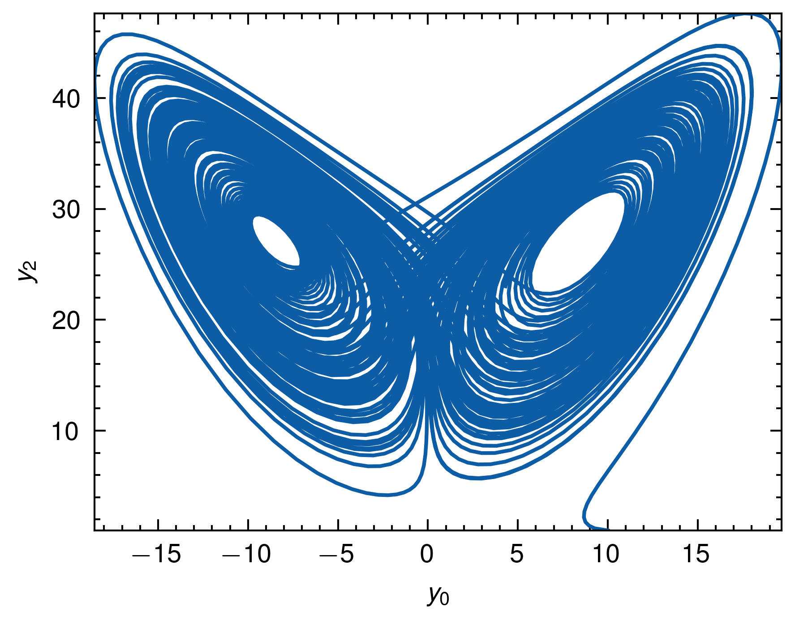

# Peroxide

[](https://crates.io/crates/peroxide)
[](https://axect.github.io/Peroxide_Doc)
[](https://zenodo.org/doi/10.5281/zenodo.10815823)


Rust numeric library contains linear algebra, numerical analysis, statistics and machine learning tools with R, MATLAB, Python like macros.

## Table of Contents

- [Why Peroxide?](#why-peroxide)
  - [1. Customize features](#1-customize-features)
  - [2. Easy to optimize](#2-easy-to-optimize)
  - [3. Friendly syntax](#3-friendly-syntax)
  - [4. Can choose two different coding styles](#4-can-choose-two-different-coding-styles)
  - [5. Batteries included](#5-batteries-included)
  - [6. Compatible with Mathematics](#6-compatible-with-mathematics)
  - [7. Written in Rust](#7-written-in-rust)
- [Latest README version](#latest-readme-version)
- [Pre-requisite](#pre-requisite)
- [Install](#install)
- [Useful tips for features](#useful-tips-for-features)
- [Module Structure](#module-structure)
- [Documentation](#documentation)
- [Examples](#examples)
- [Release Info](#release-info)
- [Contributes Guide](#contributes-guide)
- [LICENSE](#license)
- [TODO](#todo)

## Why Peroxide?

### 1. Customize features

Peroxide provides various features.

- `default` - Pure Rust (No dependencies of architecture - Perfect cross compilation)
- `O3` - BLAS & LAPACK (Perfect performance but little bit hard to set-up - Strongly recommend to look [Peroxide with BLAS](https://github.com/Axect/Peroxide_BLAS))
- `plot` - With matplotlib of python, we can draw any plots.
- `complex` - With complex numbers (vector, matrix and integral)
- `parallel` - With some parallel functions
- `nc` - To handle netcdf file format with DataFrame
- `csv` - To handle csv file format with Matrix or DataFrame
- `parquet` - To handle parquet file format with DataFrame
- `serde` - serialization with [Serde](https://serde.rs/).

If you want to do high performance computation and more linear algebra, then choose `O3` feature.
If you don't want to depend C/C++ or Fortran libraries, then choose `default` feature.
If you want to draw plot with some great templates, then choose `plot` feature.

You can choose any features simultaneously.

### 2. Easy to optimize

Peroxide uses a 1D data structure to represent matrices, making it straightforward to integrate with BLAS (Basic Linear Algebra Subprograms).
This means that Peroxide can guarantee excellent performance for linear algebraic computations by leveraging the optimized routines provided by BLAS.

### 3. Friendly syntax

For users familiar with numerical computing libraries like NumPy, MATLAB, or R, Rust's syntax might seem unfamiliar at first.
This can make it more challenging to learn and use Rust libraries that heavily rely on Rust's unique features and syntax.

However, Peroxide aims to bridge this gap by providing a syntax that resembles the style of popular numerical computing environments.
With Peroxide, you can perform complex computations using a syntax similar to that of R, NumPy, or MATLAB, making it easier for users from these backgrounds to adapt to Rust and take advantage of its performance benefits.

For example,

```rust
#[macro_use]
extern crate peroxide;
use peroxide::prelude::*;

fn main() {
    // MATLAB like matrix constructor
    let a = ml_matrix("1 2;3 4");

    // R like matrix constructor (default)
    let b = matrix(c!(1,2,3,4), 2, 2, Row);

    // Or use zeros
    let mut z = zeros(2, 2);
    z[(0,0)] = 1.0;
    z[(0,1)] = 2.0;
    z[(1,0)] = 3.0;
    z[(1,1)] = 4.0;

    // Simple but effective operations
    let c = a * b; // Matrix multiplication (BLAS integrated)

    // Easy to pretty print
    c.print();
    //       c[0] c[1]
    // r[0]     1    3
    // r[1]     2    4

    // Easy to do linear algebra
    c.det().print();
    c.inv().print();

    // and etc.
}
```

### 4. Can choose two different coding styles.

In peroxide, there are two different options.

- `prelude`: To simple use.
- `fuga`: To choose numerical algorithms explicitly.

For examples, let's see norm.

In `prelude`, use `norm` is simple: `a.norm()`. But it only uses L2 norm for `Vec<f64>`. (For `Matrix`, Frobenius norm.)
```rust
#[macro_use]
extern crate peroxide;
use peroxide::prelude::*;

fn main() {
    let a = c!(1, 2, 3);
    let l2 = a.norm();      // L2 is default vector norm

    assert_eq!(l2, 14f64.sqrt());
}
```

In `fuga`, use various norms. But you should write a little bit longer than `prelude`.
```rust
#[macro_use]
extern crate peroxide;
use peroxide::fuga::*;

fn main() {
    let a = c!(1, 2, 3);
    let l1 = a.norm(Norm::L1);
    let l2 = a.norm(Norm::L2);
    let l_inf = a.norm(Norm::LInf);
    assert_eq!(l1, 6f64);
    assert_eq!(l2, 14f64.sqrt());
    assert_eq!(l_inf, 3f64);
}
```

### 5. Batteries included

Peroxide can do many things. 

- Linear Algebra
  - Effective Matrix structure
  - Transpose, Determinant, Diagonal
  - LU Decomposition, Inverse matrix, Block partitioning
  - QR Decomposition (`O3` feature)
  - Singular Value Decomposition (SVD) (`O3` feature)
  - Cholesky Decomposition (`O3` feature)
  - Reduced Row Echelon form
  - Column, Row operations
  - Eigenvalue, Eigenvector
- Functional Programming
  - Easier functional programming with `Vec<f64>`
  - For matrix, there are three maps
    - `fmap` : map for all elements
    - `col_map` : map for column vectors
    - `row_map` : map for row vectors
- Automatic Differentiation
  - Taylor mode Forward AD - for nth order AD
  - Exact jacobian
  - `Real` trait to constrain for `f64` and `AD` (for ODE)
- Numerical Analysis
  - Lagrange interpolation
  - Splines
    - Cubic Spline
    - Cubic Hermite Spline
      - Estimate slope via Akima
      - Estimate slope via Quadratic interpolation
    - B-Spline
  - Non-linear regression
    - Gradient Descent
    - Levenberg Marquardt
  - Ordinary Differential Equation
    - Trait based ODE solver (after `v0.36.0`)
    - Explicit integrator
      - Ralston's 3rd order
      - Runge-Kutta 4th order
      - Ralston's 4th order
      - Runge-Kutta 5th order
    - Embedded integrator
      - Bogacki-Shampine 3(2)
      - Runge-Kutta-Fehlberg 4(5)
      - Dormand-Prince 5(4)
      - Tsitouras 5(4)
    - Implicit integrator
      - Gauss-Legendre 4th order
  - Numerical Integration
    - Newton-Cotes Quadrature
    - Gauss-Legendre Quadrature (up to 30 order)
    - Gauss-Kronrod Quadrature (Adaptive)
      - G7K15, G10K21, G15K31, G20K41, G25K51, G30K61
    - Gauss-Kronrod Quadrature (Relative tolerance)
      - G7K15R, G10K21R, G15K31R, G20K41R, G25K51R, G30K61R
  - Root Finding
    - Trait based root finding (after `v0.37.0`)
    - Bisection
    - False Position
    - Secant
    - Newton
    - Broyden
- Statistics
  - More easy random with `rand` crate
  - Ordered Statistics
    - Median
    - Quantile (Matched with R quantile)
  - Probability Distributions
    - Bernoulli
    - Uniform
    - Binomial
    - Normal
    - Gamma
    - Beta
    - Student's-t
    - Weighted Uniform
  - RNG algorithms
    - Acceptance Rejection
    - Marsaglia Polar
    - Ziggurat
    - Wrapper for `rand-dist` crate
    - Piecewise Rejection Sampling
  - Confusion Matrix & Metrics
- Special functions
  - Wrapper for `puruspe` crate (pure rust)
- Utils
  - R-like macro & functions
  - Matlab-like macro & functions
  - Numpy-like macro & functions
  - Julia-like macro & functions
- Plotting
  - With `pyo3` & `matplotlib`
- DataFrame
  - Support various types simultaneously
  - Read & Write `csv` files (`csv` feature)
  - Read & Write `netcdf` files (`nc` feature)
  - Read & Write `parquet` files (`parquet` feature)

### 6. Compatible with Mathematics

After `0.23.0`, peroxide is compatible with mathematical structures.
`Matrix`, `Vec<f64>`, `f64` are considered as inner product vector spaces.
And `Matrix`, `Vec<f64>` are linear operators - `Vec<f64>` to `Vec<f64>` and `Vec<f64>` to `f64`.
For future, peroxide will include more & more mathematical concepts. (But still practical.)

### 7. Written in Rust

Rust provides a strong type system, ownership concepts, borrowing rules, and other features that enable developers to write safe and efficient code. It also offers modern programming techniques like trait-based abstraction and convenient error handling. Peroxide is developed to take full advantage of these strengths of Rust.

The example code demonstrates how Peroxide can be used to simulate the Lorenz attractor and visualize the results. It showcases some of the powerful features provided by Rust, such as the `?` operator for streamlined error handling and the `ODEProblem` trait for abstracting ODE problems.

```rust
use peroxide::fuga::*;

fn main() -> Result<(), Box<dyn Error>> {
    let initial_conditions = vec![10f64, 1f64, 1f64];
    let rkf45 = RKF45::new(1e-4, 0.9, 1e-6, 1e-2, 100);
    let basic_ode_solver = BasicODESolver::new(rkf45);
    let (_, y_vec) = basic_ode_solver.solve(
        &Lorenz,
        (0f64, 100f64),
        1e-2,
        &initial_conditions,
    )?; // Error handling with `?` - can check constraint violation and etc.
    let y_mat = py_matrix(y_vec);
    let y0 = y_mat.col(0);
    let y2 = y_mat.col(2);

    // Simple but effective plotting
    let mut plt = Plot2D::new();
    plt
        .set_domain(y0)
        .insert_image(y2)
        .set_xlabel(r"$y_0$")
        .set_ylabel(r"$y_2$")
        .set_style(PlotStyle::Nature)
        .tight_layout()
        .set_dpi(600)
        .set_path("example_data/lorenz_rkf45.png")
        .savefig()?;

    Ok(())
}

struct Lorenz;

impl ODEProblem for Lorenz {
    fn rhs(&self, t: f64, y: &[f64], dy: &mut [f64]) -> anyhow::Result<()> {
        dy[0] = 10f64 * (y[1] - y[0]);
        dy[1] = 28f64 * y[0] - y[1] - y[0] * y[2];
        dy[2] = -8f64 / 3f64 * y[2] + y[0] * y[1];
        Ok(())
    }
}
```

Running the code produces the following visualization of the Lorenz attractor:



Peroxide strives to leverage the benefits of the Rust language while providing a user-friendly interface for numerical computing and scientific simulations.

How's that? Let me know if there's anything else you'd like me to improve!

## Latest README version

Corresponding to `0.38.0`

## Pre-requisite

- For `O3` feature - Need `OpenBLAS`
- For `plot` feature - Need `matplotlib` and optional `scienceplots` (for publication quality)
- For `nc` feature - Need `netcdf`

## Install

### Basic Installation
```bash
cargo add peroxide
```

### Featured Installation
```bash
cargo add peroxide --features "<FEATURES>"
```

### Available Features

* `O3`: Adds OpenBLAS support
* `plot`: Enables plotting functionality
* `complex`: Supports complex number operations
* `parallel`: Enables parallel processing capabilities
* `nc`: Adds NetCDF support for DataFrame
* `csv`: Adds CSV support for DataFrame
* `parquet`: Adds Parquet support for DataFrame
* `serde`: Enables serialization/deserialization for Matrix and polynomial

### Install Examples

Single feature installation:
```bash
cargo add peroxide --features "plot"
```

Multiple features installation:
```bash
cargo add peroxide --features "O3 plot nc csv parquet serde"
```

## Useful tips for features

- If you want to use _QR_, _SVD_, or _Cholesky Decomposition_, you should use the `O3` feature. These decompositions are not implemented in the `default` feature.

- If you want to save your numerical results, consider using the `parquet` or `nc` features, which correspond to the `parquet` and `netcdf` file formats, respectively. These formats are much more efficient than `csv` and `json`.

- For plotting, it is recommended to use the `plot` feature. However, if you require more customization, you can use the `parquet` or `nc` feature to export your data in the parquet or netcdf format and then use Python to create the plots.

  - To read parquet files in Python, you can use the `pandas` and `pyarrow` libraries.

  - A template for Python code that works with netcdf files can be found in the [Socialst](https://github.com/Axect/Socialst/blob/master/Templates/PyPlot_Template/nc_plot.py) repository.


## Module Structure

- __src__
  - [lib.rs](src/lib.rs) : `mod` and `re-export`
  - __complex__: For complex vector, matrix & integrals.
    - [mod.rs](src/complex/mod.rs)
    - [integrate.rs](src/complex/integrate.rs) : Complex integral
    - [matrix.rs](src/complex/matrix.rs) : Complex matrix
    - [vector.rs](src/complex/vector.rs) : Complex vector
  - __fuga__ : Fuga for controlling numerical algorithms.
    - [mod.rs](src/fuga/mod.rs)
  - __macros__ : Macro files
    - [julia_macro.rs](src/macros/julia_macro.rs) : Julia like macro
    - [matlab_macro.rs](src/macros/matlab_macro.rs) : MATLAB like macro
    - [mod.rs](src/macros/mod.rs)
    - [r_macro.rs](src/macros/r_macro.rs) : R like macro
  - __ml__ : For machine learning (_Beta_)
    - [mod.rs](src/ml/mod.rs)
    - [reg.rs](src/ml/reg.rs) : Regression tools
  - __numerical__ : To do numerical things
    - [mod.rs](src/numerical/mod.rs)
    - [eigen.rs](src/numerical/eigen.rs) : Eigenvalue, Eigenvector algorithm
    - [integral.rs](src/numerical/integral.rs) : Numerical integration
    - [interp.rs](src/numerical/interp.rs) : Interpolation
    - [newton.rs](src/numerical/newton.rs) : Newton's Method
    - [ode.rs](src/numerical/ode.rs) : Main ODE solver with various algorithms
    - [optimize.rs](src/numerical/optimize.rs) : Non-linear regression
    - [root.rs](src/numerical/root.rs) : Root finding
    - [spline.rs](src/numerical/spline.rs) : Cubic spline, Cubic Hermite spline & B-Spline
    - [utils.rs](src/numerical/utils.rs) : Utils to do numerical things (e.g. jacobian)
  - __prelude__ : Prelude for using simple
    - [mod.rs](src/prelude/mod.rs)
    - [simpler.rs](src/prelude/simpler.rs) : Provides more simple api
  - __special__ : Special functions written in pure Rust (Wrapper of `puruspe`)
    - [mod.rs](src/special/mod.rs)
    - [function.rs](src/special/function.rs) : Special functions
  - __statistics__ : Statistical Tools
    - [mod.rs](src/statistics/mod.rs)
    - [dist.rs](src/statistics/dist.rs) : Probability distributions
    - [ops.rs](src/statistics/ops.rs) : Some probabilistic operations
    - [rand.rs](src/statistics/rand.rs) : Wrapper for `rand` crate & Piecewise Rejection Sampling
    - [stat.rs](src/statistics/stat.rs) : Statistical tools
  - __structure__ : Fundamental data structures
    - [mod.rs](src/structure/mod.rs)
    - [ad.rs](src/structure/ad.rs) : Automatic Differentation
    - [dataframe.rs](src/structure/dataframe.rs) : Dataframe
    - [matrix.rs](src/structure/matrix.rs) : Matrix
    - [polynomial.rs](src/structure/polynomial.rs) : Polynomial
    - [sparse.rs](src/structure/sparse.rs) : For sparse structure (_Beta_)
    - [vector.rs](src/structure/vector.rs) : Extra tools for `Vec<f64>`
  - __traits__
    - [mod.rs](src/traits/mod.rs)
    - [fp.rs](src/traits/fp.rs) : Functional programming toolbox
    - [general.rs](src/traits/general.rs) : General algorithms
    - [math.rs](src/traits/math.rs) : Mathematics
    - [matrix.rs](src/traits/matrix.rs) : Matrix traits
    - [mutable.rs](src/traits/mutable.rs) : Mutable toolbox
    - [num.rs](src/traits/num.rs) : Number, Real and more operations
    - [pointer.rs](src/traits/pointer.rs) : Matrix pointer and Vector pointer for convenience
    - [stable.rs](src/traits/stable.rs) : Implement nightly-only features in stable
    - [sugar.rs](src/traits/sugar.rs) : Syntactic sugar for Vector
  - __util__
    - [mod.rs](src/util/mod.rs)
    - [api.rs](src/util/api.rs) : Matrix constructor for various language style
    - [low_level.rs](src/util/low_level.rs) : Low-level tools
    - [non_macro.rs](src/util/non_macro.rs) : Primordial version of macros
    - [plot.rs](src/util/plot.rs) : To draw plot (using `pyo3`)
    - [print.rs](src/util/print.rs) : To print conveniently
    - [useful.rs](src/util/useful.rs) : Useful utils to implement library
    - [wrapper.rs](src/util/wrapper.rs) : Wrapper for other crates (e.g. rand)
    - [writer.rs](src/util/writer.rs) : More convenient write system

## Documentation

- [](https://axect.github.io/Peroxide_Doc)

## Examples

- In [examples](./examples) directory, there are some examples.

- In [tests](./tests) directory, there are some useful tests.

- More examples are in [Peroxide Gallery](https://github.com/Axect/Peroxide_Gallery).

## Release Info

To see [RELEASES.md](./RELEASES.md)

## Contributes Guide

See [CONTRIBUTES.md](./CONTRIBUTES.md)

## LICENSE

Peroxide is licensed under dual licenses - Apache License 2.0 and MIT License.

## TODO

To see [TODO.md](./TODO.md)

## Cite Peroxide

Hey there!
If you're using Peroxide in your research or project, you're not required to cite us.
But if you do, we'd be really grateful! 😊

To make citing Peroxide easy, we've created a DOI through Zenodo. Just click on this badge:

[](https://zenodo.org/doi/10.5281/zenodo.10815823)

This will take you to the Zenodo page for Peroxide.
At the bottom, you'll find the citation information in various formats like BibTeX, RIS, and APA.

So, if you want to acknowledge the work we've put into Peroxide, citing us would be a great way to do it! Thanks for considering it, we appreciate your support! 👍
