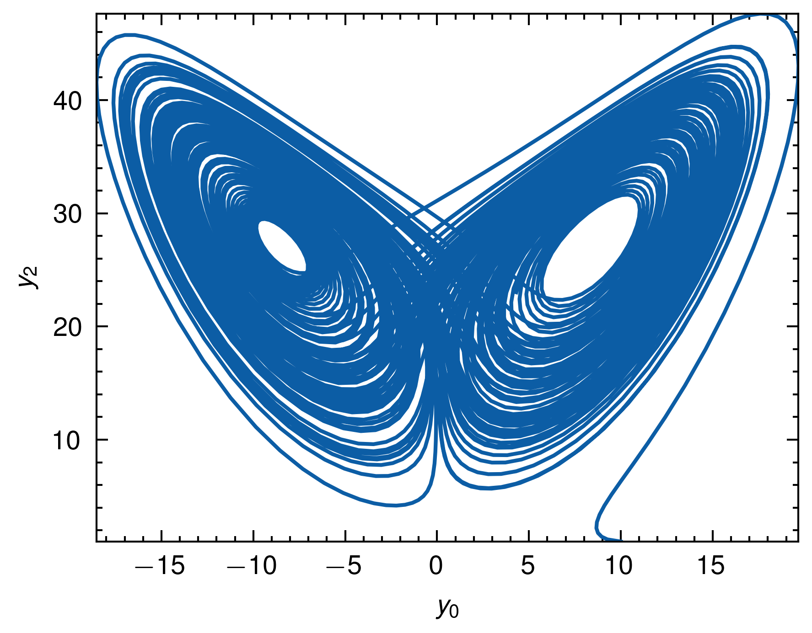

# Peroxide

[](https://crates.io/crates/peroxide)
[](https://docs.rs/peroxide)
[](https://zenodo.org/doi/10.5281/zenodo.10815823)


Rust numeric library contains linear algebra, numerical analysis, statistics and machine learning tools with R, MATLAB, Python like macros.

## Quickstart

```bash
cargo add peroxide   # default profile is pure Rust, no system libraries needed
```

```rust
#[macro_use]
extern crate peroxide;
use peroxide::fuga::*;

fn main() {
    // R / MATLAB-style matrix literals
    let a = ml_matrix("1 2; 3 4");
    let b = c!(5, 6);

    // matrix-vector product (BLAS-dispatched when an `O3-*` feature is on)
    let c = &a * &b;

    a.print(); // pretty-formatted matrix
    c.print(); // [17, 39]
    a.det().print(); // -2
    a.inv().print();
}
```

For accelerated linear algebra, plotting, or DataFrame I/O, enable the matching feature flag (see [Install](#install) and [Available features](#available-features)).

## Table of Contents

- [Peroxide](#peroxide)
  - [Table of Contents](#table-of-contents)
  - [Why Peroxide?](#why-peroxide)
    - [1. Customize features](#1-customize-features)
    - [2. Easy to optimize](#2-easy-to-optimize)
    - [3. Friendly syntax](#3-friendly-syntax)
    - [4. Can choose two different coding styles.](#4-can-choose-two-different-coding-styles)
    - [5. Batteries included](#5-batteries-included)
    - [6. Compatible with Mathematics](#6-compatible-with-mathematics)
    - [7. Written in Rust](#7-written-in-rust)
  - [Pre-requisite](#pre-requisite)
  - [Install](#install)
    - [Most common combinations](#most-common-combinations)
    - [Available features](#available-features)
  - [Examples](#examples)
  - [Release notes](#release-notes)
  - [Contributing](#contributing)
  - [License](#license)
  - [Cite Peroxide](#cite-peroxide)

## Why Peroxide?

### 1. Customize features

Peroxide provides various features.

- `default` - Pure Rust (No dependencies of architecture - Perfect cross compilation)
- `O3` - BLAS & LAPACK (Perfect performance but little bit hard to set-up - Strongly recommend to look [Peroxide with BLAS](https://github.com/Axect/Peroxide_BLAS))
- `plot` - With matplotlib of python, we can draw any plots.
- `complex` - With complex numbers (vector, matrix and integral)
- `parallel` - With some parallel functions
- `nc` - To handle netcdf file format with DataFrame
- `csv` - To handle csv file format with Matrix or DataFrame
- `parquet` - To handle parquet file format with DataFrame
- `serde` - serialization with [Serde](https://serde.rs/).
- `rkyv` - serialization with [rkyv](https://rkyv.org).

If you want to do high performance computation and more linear algebra, then choose `O3` feature.
If you don't want to depend C/C++ or Fortran libraries, then choose `default` feature.
If you want to draw plot with some great templates, then choose `plot` feature.

You can choose any features simultaneously.

### 2. Easy to optimize

Peroxide uses a 1D data structure to represent matrices, making it straightforward to integrate with BLAS (Basic Linear Algebra Subprograms).
This means that Peroxide can guarantee excellent performance for linear algebraic computations by leveraging the optimized routines provided by BLAS.

### 3. Friendly syntax

For users familiar with numerical computing libraries like NumPy, MATLAB, or R, Rust's syntax might seem unfamiliar at first.
This can make it more challenging to learn and use Rust libraries that heavily rely on Rust's unique features and syntax.

However, Peroxide aims to bridge this gap by providing a syntax that resembles the style of popular numerical computing environments.
With Peroxide, you can perform complex computations using a syntax similar to that of R, NumPy, or MATLAB, making it easier for users from these backgrounds to adapt to Rust and take advantage of its performance benefits.

For example,

```rust
#[macro_use]
extern crate peroxide;
use peroxide::prelude::*;

fn main() {
    // MATLAB like matrix constructor
    let a = ml_matrix("1 2;3 4");

    // R like matrix constructor (default)
    let b = matrix(c!(1,2,3,4), 2, 2, Row);

    // Or use zeros
    let mut z = zeros(2, 2);
    z[(0,0)] = 1.0;
    z[(0,1)] = 2.0;
    z[(1,0)] = 3.0;
    z[(1,1)] = 4.0;

    // Simple but effective operations
    let c = a * b; // Matrix multiplication (BLAS integrated)

    // Easy to pretty print
    c.print();
    //       c[0] c[1]
    // r[0]     1    3
    // r[1]     2    4

    // Easy to do linear algebra
    c.det().print();
    c.inv().print();

    // and etc.
}
```

### 4. Can choose two different coding styles.

In peroxide, there are two different options.

- `prelude`: To simple use.
- `fuga`: To choose numerical algorithms explicitly.

For examples, let's see norm.

In `prelude`, use `norm` is simple: `a.norm()`. But it only uses L2 norm for `Vec<f64>`. (For `Matrix`, Frobenius norm.)
```rust
#[macro_use]
extern crate peroxide;
use peroxide::prelude::*;

fn main() {
    let a = c!(1, 2, 3);
    let l2 = a.norm();      // L2 is default vector norm

    assert_eq!(l2, 14f64.sqrt());
}
```

In `fuga`, use various norms. But you should write a little bit longer than `prelude`.
```rust
#[macro_use]
extern crate peroxide;
use peroxide::fuga::*;

fn main() {
    let a = c!(1, 2, 3);
    let l1 = a.norm(Norm::L1);
    let l2 = a.norm(Norm::L2);
    let l_inf = a.norm(Norm::LInf);
    assert_eq!(l1, 6f64);
    assert_eq!(l2, 14f64.sqrt());
    assert_eq!(l_inf, 3f64);
}
```

### 5. Batteries included

Peroxide can do many things. 

- Linear Algebra: effective `Matrix` structure, LU / QR / SVD / Cholesky decompositions (`O3` feature for the last three), determinant, inverse, block partitioning, reduced row echelon form, eigenvalue & eigenvector
- Functional Programming: easier functional programming with `Vec<f64>`; matrix maps (`fmap`, `col_map`, `row_map`)
- Automatic Differentiation: const-generic `Jet<N>` for arbitrary-order forward AD (`Dual`, `HyperDual` aliases), `#[ad_function]` proc macro, exact Jacobian via `jacobian()`, `Real` trait over `f64` and `Jet<N>`
- Numerical Analysis
  - Interpolation & splines: Lagrange interpolation, Cubic / Cubic Hermite (Akima, quadratic slope estimation) / B-Spline
  - Non-linear regression: Gradient Descent, Levenberg-Marquardt
  - ODE (trait-based since `v0.36.0`): explicit (Ralston 3rd & 4th, Runge-Kutta 4th & 5th), embedded (Bogacki-Shampine 3(2), Runge-Kutta-Fehlberg 5(4) & 8(7), Dormand-Prince 5(4), Tsitouras 5(4)), implicit (Gauss-Legendre 4th)
  - Numerical integration: Newton-Cotes, Gauss-Legendre (up to 30th order), adaptive Gauss-Kronrod (G7K15 through G30K61, absolute & relative tolerance variants)
  - Root finding (trait-based since `v0.37.0`): Bisection, False Position, Secant, Newton, Broyden
- Statistics: probability distributions (Bernoulli, Uniform, Binomial, Normal, Gamma, Beta, Student's-t, LogNormal, Weighted Uniform), RNG algorithms (Acceptance-Rejection, Marsaglia Polar, Ziggurat, Piecewise Rejection Sampling), ordered statistics (median, R-compatible quantile), confusion matrix & metrics
- Special functions: wrapper of the pure-Rust `puruspe` crate
- Utils: R / MATLAB / NumPy / Julia style macros & functions
- Plotting: matplotlib-based `Plot2D` via `pyo3` (`plot` feature)
- DataFrame: mixed-type columns; CSV / NetCDF / Parquet I/O (`csv` / `nc` / `parquet` features); shape & info, row / column operations, series & frame statistics (`describe`, `mean`, ...)

### 6. Compatible with Mathematics

After `0.23.0`, peroxide is compatible with mathematical structures.
`Matrix`, `Vec<f64>`, `f64` are considered as inner product vector spaces.
And `Matrix`, `Vec<f64>` are linear operators - `Vec<f64>` to `Vec<f64>` and `Vec<f64>` to `f64`.
For future, peroxide will include more & more mathematical concepts. (But still practical.)

### 7. Written in Rust

Rust provides a strong type system, ownership concepts, borrowing rules, and other features that enable developers to write safe and efficient code. It also offers modern programming techniques like trait-based abstraction and convenient error handling. Peroxide is developed to take full advantage of these strengths of Rust.

The example code demonstrates how Peroxide can be used to simulate the Lorenz attractor and visualize the results. It showcases some of the powerful features provided by Rust, such as the `?` operator for streamlined error handling and the `ODEProblem` trait for abstracting ODE problems.

```rust
use peroxide::fuga::*;

fn main() -> Result<(), Box<dyn Error>> {
    let initial_conditions = vec![10f64, 1f64, 1f64];
    let rkf45 = RKF45::new(1e-4, 0.9, 1e-6, 1e-2, 100);
    let basic_ode_solver = BasicODESolver::new(rkf45);
    let (_, y_vec) = basic_ode_solver.solve(
        &Lorenz,
        (0f64, 100f64),
        1e-2,
        &initial_conditions,
    )?; // Error handling with `?` - can check constraint violation and etc.
    let y_mat = py_matrix(y_vec);
    let y0 = y_mat.col(0);
    let y2 = y_mat.col(2);

    // Simple but effective plotting
    let mut plt = Plot2D::new();
    plt
        .set_domain(y0)
        .insert_image(y2)
        .set_xlabel(r"$y_0$")
        .set_ylabel(r"$y_2$")
        .set_style(PlotStyle::Nature)
        .tight_layout()
        .set_dpi(600)
        .set_path("example_data/lorenz_rkf45.png")
        .savefig()?;

    Ok(())
}

struct Lorenz;

impl ODEProblem for Lorenz {
    fn rhs(&self, t: f64, y: &[f64], dy: &mut [f64]) -> anyhow::Result<()> {
        dy[0] = 10f64 * (y[1] - y[0]);
        dy[1] = 28f64 * y[0] - y[1] - y[0] * y[2];
        dy[2] = -8f64 / 3f64 * y[2] + y[0] * y[1];
        Ok(())
    }
}
```

Running the code produces the following visualization of the Lorenz attractor:



Peroxide strives to leverage the benefits of the Rust language while providing a user-friendly interface for numerical computing and scientific simulations.

## Pre-requisite

Most features are pure Rust and require no system setup.
The three groups below depend on external libraries or runtimes; install the relevant prerequisites before enabling the corresponding feature flag.

### `O3`: BLAS + LAPACK

`O3` enables hardware-accelerated linear algebra (LU, QR, SVD, Cholesky, GEMV/GEMM dispatch) through the [`blas`](https://crates.io/crates/blas) and [`lapack`](https://crates.io/crates/lapack) FFI crates.
Those crates only provide function signatures, so the link backend that supplies the actual `dgemv_` / `dpotrf_` / ... symbols must be selected separately.
The simplest path is to enable one of the convenience flags below; each pulls in [`blas-src`](https://crates.io/crates/blas-src) and [`lapack-src`](https://crates.io/crates/lapack-src) with the matching backend.

| Convenience flag  | Backend            | Typical platform / use case             |
| ----------------- | ------------------ | --------------------------------------- |
| `O3-openblas`     | OpenBLAS           | Linux, Windows, macOS via Homebrew      |
| `O3-accelerate`   | Apple Accelerate   | macOS (no extra system install)         |
| `O3-mkl`          | Intel MKL          | Intel CPUs, vendor-tuned performance    |
| `O3-netlib`       | Netlib reference   | Portability, lowest performance         |

If you need a backend not in the list above (for example BLIS or R's BLAS), enable the bare `O3` flag and add `blas-src` / `lapack-src` to your downstream binary's `Cargo.toml` with the appropriate features yourself.

System libraries still need to be present on the host for `O3-openblas` and `O3-netlib`; install them with:

| Platform              | Install                                              |
| --------------------- | ---------------------------------------------------- |
| Debian / Ubuntu       | `sudo apt install libopenblas-dev liblapack-dev`     |
| Fedora / RHEL         | `sudo dnf install openblas-devel lapack-devel`       |
| Arch Linux            | `sudo pacman -S openblas lapack`                     |
| macOS (Homebrew)      | `brew install openblas lapack`                       |

`O3-accelerate` and `O3-mkl` ship their own backend (Apple's framework and Intel's redistributable, respectively), so they need no further system packages.

### `plot` / `pyo3`: Python 3 + matplotlib

`plot` enables the high-level `Plot2D` API, which renders figures by delegating to matplotlib through [`pyo3`](https://crates.io/crates/pyo3).
Python 3 with development headers is required at build time, and matplotlib is required at runtime.

| Step                                       | Command                                            |
| ------------------------------------------ | -------------------------------------------------- |
| Install Python 3 + dev headers (Debian)    | `sudo apt install python3 python3-dev`             |
| Install Python 3 + dev headers (Fedora)    | `sudo dnf install python3 python3-devel`           |
| Install matplotlib                         | `pip install matplotlib`                           |
| (Optional) Publication-quality styles      | `pip install scienceplots`                         |

If you use a virtual environment, activate it before building so that `pyo3` resolves to the intended interpreter (e.g. `source .venv/bin/activate`).
The plain `pyo3` flag enables the Python interop layer without pulling in the `Plot2D` API.

### `nc` / `netcdf`: HDF5 + netCDF-C

`nc` (alias `netcdf`) enables NetCDF I/O for `DataFrame` via the [`netcdf`](https://crates.io/crates/netcdf) crate, which links against the system HDF5 and netCDF-C libraries.

| Platform              | Install                                              |
| --------------------- | ---------------------------------------------------- |
| Debian / Ubuntu       | `sudo apt install libnetcdf-dev libhdf5-dev`         |
| Fedora / RHEL         | `sudo dnf install netcdf-devel hdf5-devel`           |
| Arch Linux            | `sudo pacman -S netcdf hdf5`                         |
| macOS (Homebrew)      | `brew install netcdf hdf5`                           |

> **Note:** Peroxide currently pins `netcdf = "0.7"`, which transitively uses `hdf5-sys 0.8.x`.
> That `hdf5-sys` only recognizes the **HDF5 1.x** version string and rejects HDF5 2.x with `Invalid H5_VERSION`.
> If your distribution ships HDF5 2.x (e.g. recent rolling-release Linux), install an HDF5 1.14.x package alongside (Debian/Ubuntu LTS releases still default to 1.10/1.14) or wait for the planned bump to `netcdf 0.12`.
> The `nc` build will succeed against any HDF5 1.x.

## Install

Peroxide builds on **stable Rust 1.91 or later**.
The default profile is pure Rust; system libraries are only needed for the features listed in the [Pre-requisite](#pre-requisite) section.

```bash
cargo add peroxide                              # default (pure Rust)
cargo add peroxide --features "<FEATURES>"      # opt-in features
```

### Most common combinations

| Goal                                              | Command                                                                   |
| ------------------------------------------------- | ------------------------------------------------------------------------- |
| Linear algebra on Linux / Windows                 | `cargo add peroxide --features O3-openblas`                               |
| Linear algebra on macOS                           | `cargo add peroxide --features O3-accelerate`                             |
| Plotting via Python / matplotlib                  | `cargo add peroxide --features plot`                                      |
| DataFrame + Parquet I/O                           | `cargo add peroxide --features parquet`                                   |
| Full Linux scientific stack                       | `cargo add peroxide --features "O3-openblas plot nc csv parquet serde"`   |
| Full macOS scientific stack                       | `cargo add peroxide --features "O3-accelerate plot nc csv parquet serde"` |

### Available features

Most users only need the **composite flags** in the first table.
The remaining single-crate flags exist so advanced users can pull in just one optional dependency without enabling the rest.

**Composite flags (recommended)**

| Flag             | Requires                | Purpose                                                       |
| ---------------- | ----------------------- | ------------------------------------------------------------- |
| `O3-openblas`    | OpenBLAS                | BLAS / LAPACK accelerated linear algebra (Linux / Windows)    |
| `O3-accelerate`  | Apple Accelerate        | Same, using the Accelerate framework on macOS                 |
| `O3-mkl`         | Intel MKL               | Same, using Intel MKL                                         |
| `O3-netlib`      | Netlib                  | Same, using the reference Netlib BLAS                         |
| `plot`           | Python 3 + matplotlib   | High-level `Plot2D` API                                       |
| `nc`             | HDF5 + netCDF-C         | NetCDF I/O for `DataFrame`                                    |
| `parquet`        | (pure Rust)             | Parquet I/O for `DataFrame` (pulls in `arrow`, `indexmap`)    |
| `complex`        | (pure Rust)             | Complex vectors / matrices + `cgemm` matmul                   |
| `parallel`       | (pure Rust)             | Parallel iterators on vectors / matrices                      |
| `csv`            | (pure Rust)             | CSV I/O for `DataFrame`                                       |
| `json`           | (pure Rust)             | JSON I/O for `DataFrame`                                      |
| `serde`          | (pure Rust)             | `serde` (de)serialization                                     |
| `rkyv`           | (pure Rust)             | `rkyv` zero-copy (de)serialization                            |

<details>
<summary><b>Advanced: single-crate flags</b></summary>

These flags enable one optional dependency in isolation.
Use them only if you want to depend on the underlying crate without the surrounding Peroxide API.

| Flag          | Underlying crate | Notes                                                       |
| ------------- | ---------------- | ----------------------------------------------------------- |
| `O3`          | `blas`, `lapack` | Bare BLAS / LAPACK FFI; bring your own `blas-src` / `lapack-src` |
| `blas`        | `blas`           | Raw BLAS bindings only                                      |
| `lapack`      | `lapack`         | Raw LAPACK bindings only                                    |
| `pyo3`        | `pyo3`           | Python 3 interop without the `Plot2D` API                   |
| `netcdf`      | `netcdf`         | Alias for `nc`                                              |
| `num-complex` | `num-complex`    | Raw complex-number dependency only                          |
| `rayon`       | `rayon`          | Raw rayon dependency only                                   |
| `arrow`       | `arrow`          | Raw arrow dependency only                                   |
| `indexmap`    | `indexmap`       | Raw indexmap dependency only                                |

</details>

## Examples

Runnable programs covering every component live in [`examples/`](./examples), with longer worked notebooks in the companion [Peroxide_Gallery](https://github.com/Axect/Peroxide_Gallery) repository.
API reference and feature-specific guidance are published on [docs.rs/peroxide](https://docs.rs/peroxide).

## Release notes

See [RELEASES.md](./RELEASES.md).

## Contributing

See [CONTRIBUTING.md](./CONTRIBUTING.md).

## License

Peroxide is licensed under dual licenses: Apache License 2.0 and MIT License.

## Cite Peroxide

Hey there!
If you're using Peroxide in your research or project, you're not required to cite us.
But if you do, we'd be really grateful! 😊

To make citing Peroxide easy, we've created a DOI through Zenodo. Just click on this badge:

[](https://zenodo.org/doi/10.5281/zenodo.10815823)

This will take you to the Zenodo page for Peroxide.
At the bottom, you'll find the citation information in various formats like BibTeX, RIS, and APA.

So, if you want to acknowledge the work we've put into Peroxide, citing us would be a great way to do it! Thanks for considering it, we appreciate your support! 👍
